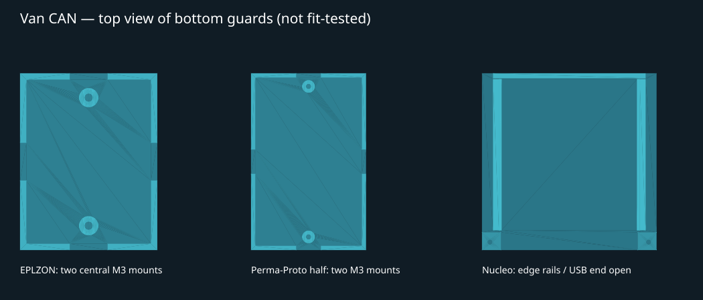

# Engine-node hardware

[Documentation index](README.md) · [Next: bench setup](bench-setup.md)

The first node uses development boards and a small discrete sensor circuit.
There is no custom PCB or finalized enclosure design in this repository yet.

## Bench parts

| Quantity | Part | Role |
| ---: | --- | --- |
| 1 | ST NUCLEO-G0B1RE | Runs the firmware and samples the sensor |
| 1 | Adafruit CAN Pal | Connects the MCU's CAN peripheral to the CAN wires |
| 1 | BTT U2C V2.1 with candleLight/gs_usb-compatible firmware | Laptop USB-to-CAN interface |
| 2 | TX3 coolant thermistors | Pre-radiator and post-radiator inputs |
| 2 each | 2.00 kohm and 470 ohm resistors | Separate nominal 2.47 kohm pull-up for each sensor |
| 2 | 1 kohm resistors | Separate series resistor into A0 and A1 |
| 2 | 100 nF ceramic capacitors | ADC input filtering to ground, one per channel |
| 2 total | 120-ohm CAN terminators | One at each bus end; use the boards' termination facilities |
| As needed | USB data cables, hookup wire, prototyping board | Power, programming, and assembly |
| 1 | Multimeter | Continuity, resistance, and voltage checks |

The two terminators are the total for this bench bus, not two extra resistors
to add when board termination is already enabled. Detailed interconnects are in
[bench setup](bench-setup.md).

## First coolant input

The TX3 is used as a two-wire thermistor. Its resistance and the pull-up form a
voltage divider. The MCU reads the divider through a 1-kohm series resistor.

```text
Nucleo 3V3
    |
  2.00 kohm
    |
   470 ohm
    |
    +-------- 1 kohm -------- A0 / PA0 / ADC1_IN0
    |
 TX3 thermistor
    |
dedicated sensor return ----- Nucleo GND
```

This is the bench circuit. The 1-kohm resistor alone is not a complete
automotive transient-protection circuit. The vehicle sensor-input protection
is still to be designed and added.

The thermistor itself is not polarized. Keep a consistent signal/return wire
assignment, with the return carried back to the engine node rather than using
the engine block as the sensor return. The reserved 5 V supply in the future
sensor connector is for active sensors; this TX3 divider uses **3.3 V**.

The current code assumes a 2470-ohm pull-up. If the measured combination differs,
update `TX3_PULLUP_OHMS` in [tx3_sensor.h](../Inc/tx3_sensor.h). The conversion
in [tx3_sensor.c](../Src/tx3_sensor.c) uses these three fit points:

| Temperature | Resistance used by the firmware fit |
| ---: | ---: |
| 0 °C | 9335 ohms |
| 20 °C | 3500 ohms |
| 80 °C | 336 ohms |

These are the project's current calibration assumptions, not a guarantee for
every replacement sensor. Compare your sensor with an independent temperature
measurement before relying on its readings. The firmware averages 32 ADC
samples and reports both the raw count and calculated temperature.

## Second coolant input

Duplicate the first divider on **A1/PA1/ADC1_IN1** for post-radiator coolant.
Do not share its signal junction or pull-up with A0. Both sensors use the same
conversion constants and nominal pull-up value. Add the 100 nF filter from
each ADC pin to ground, after that channel's 1-kohm series resistor.
See [second-channel wiring and tests](bench-setup.md#second-coolant-channel).

## Vehicle hardware in preparation

The [harness plan](engine-node-harness.md) contains the purchased power-stage
parts and staged test procedure: series diode, surge resistor, TVS, input
capacitors, and a RECOM R-78K5.0-1.0 converter. Their selection is not a record
of completed vehicle-transient testing.

The intended external connections are:

- **C1, 6-pin:** power, ground, CAN-H, CAN-L, reserved wake, and a spare.
- **C2, 12-pin:** coolant inputs/returns, future active-sensor power/return,
  pressure signals, and spares.

Both connector sizes are now available for the build. Their exact housing part
numbers, contact selection, face orientation, and mounting details still need
to be recorded. Follow the provisional cavity tables in the harness plan; do
not infer physical cavity positions from a generic connector picture.

Both TX3 channels are implemented and bench reception is confirmed. GlowShift
pressure inputs remain planned; reserved pins do not imply working pressure
input circuits or firmware support.

## Printable bottom guards — first fit prototypes

These are **open-top bench guards**, not sealed, automotive-qualified boxes.
They protect the underside from a flat work surface; open sides/top do not
exclude loose wire strands, tools, moisture, or metal debris. Remove the board
before soldering, drilling, or tapping plastic. Do not pot the electronics or
lay solder joints directly on the floor.



| Board | Printable file | Dimensions / mounting |
| --- | --- | --- |
| EPLZON pictured 1.5 × 2 inch board | [Bottom tray STL](../hardware/protective-plates/stl/eplzon_38x51_tray.stl) | 43.3 × 56 × 8.4 mm; two central M3 locations, 40.6 mm apart |
| Adafruit Perma-Proto half, product 1609 | [Bottom tray STL](../hardware/protective-plates/stl/permaproto_half_1609_tray.stl) | 56 × 86.48 × 8.4 mm; two M3 locations, 73.66 mm apart |
| Nucleo MB1360, intact ST-Link, measured 8 mm pins | [Edge-retaining tray STL](../hardware/protective-plates/stl/nucleo_edge_tray_8mm_pins.stl) | 88 × 89.5 × 15.6 mm; 70 × 82.5 mm PCB, no board screws |
| Nucleo removable front stops | [Left STL](../hardware/protective-plates/stl/nucleo_stop_left.stl), [right STL](../hardware/protective-plates/stl/nucleo_stop_right.stl) | Print one each; two M3 × 6 mm screws into the tray, not the PCB |

All dimensions are millimetres. Import at **100% scale**, flat bottom on the
bed, with posts/spacers upright. The proto trays provide 6 mm from floor top
to PCB underside, a 2.4 mm floor, 2 mm low guards, and 12 mm wire notches on
all sides. Wires can also leave over the low rim. These notches are not strain
relief: secure cables separately without pulling on solder joints.

### Print and fit the proto trays

1. Print the small [EPLZON hole-spacing test](../hardware/protective-plates/stl/eplzon_38x51_fit_test.stl)
   and [Perma-Proto hole-spacing test](../hardware/protective-plates/stl/permaproto_half_1609_fit_test.stl)
   first. They are 1.2 mm-thick rails for checking hole alignment and pilot-hole
   print quality, **not electrical bottom protectors**. Check against the
   unpowered board's component side or use a paper template so the rail does
   not press on solder joints.
2. Print the full tray in ordinary, non-conductive **PETG for the bench**.
   Start with a 0.4 mm nozzle, 0.20 mm layers, four walls, five top/bottom
   layers, 20–30% infill, no supports. Use your filament maker's temperature
   profile and your CC2's calibrated flow settings; no printer-specific G-code
   is supplied. Use a brim if needed for adhesion.
3. Posts have **2.7 mm blind pilots**, intended for gently tapping M3 threads
   or carefully forming them with a machine screw. Test on scrap first.
   Start with M3 × 6 mm screws for a nominal 1.6 mm PCB; verify actual engagement
   and do not bottom out. Prefer nylon screws; if using metal, ensure the head
   and any washer stay within the mechanical-hole keepout. Do not overtighten.
4. The EPLZON tray uses the two **central 3.2 mm holes**, NOT the four M2 corner
   holes. The mounting posts touch a 6 mm-diameter area around each hole: check
   that this area has no soldered lead or component on your actual board.
5. Measure the longest underside solder/wire projection. With 6 mm supports,
   keep it below 4 mm to retain at least 2 mm of clearance. If it is longer,
   increase `clearance` in the model rather than forcing the board down.
6. Confirm the board is supported only at its mounting points, is not bowed,
   and does not rock. The two-post arrangement is a bench prototype, not
   validated support for heavy components or vehicle vibration.

### Nucleo: edge-retaining tray for 8 mm bottom pins

The user supplied the MB1360 mechanical drawing (70 × 82.5 mm) and measured
8 mm pin projection. The PCB underside is therefore **10 mm above the floor**,
leaving **2 mm nominal pin clearance**. Keep the ST-Link section attached.
There are no assumed PCB mounting holes: the rails support/capture its long
edges and two removable front corner stops prevent sliding out.

1. Print the [full-width rail-fit coupon](../hardware/protective-plates/stl/nucleo_rail_fit_test.stl)
   first. It has the same rail spacing, clearance, and 2.0 mm slot as the full
   tray, but is only 12 mm long. The slot assumes 1.6 mm PCB thickness plus
   0.4 mm vertical allowance; width clearance is 0.5 mm per side.
2. With **all power/cables removed**, inspect the outer 0.8 mm strip along both
   long edges, on both faces. It must be free of components, solder, wiring,
   and protruding header plastic where the lips/supports contact. Sideways
   board play can increase contact overlap to about 1.3 mm on one side; check
   that wider strip too. The supplied top drawing does not establish underside
   keepouts. Do not force the coupon or tray past a connector or solder joint.
3. Print the tray and one of each front stop, using the PETG settings above.
   Flat bases go on the bed; lips are only 1.3 mm overhangs and are intended to
   print without supports. Inspect the slicer's layers and remove any droop
   before test-fitting. Do not scale the entire model to correct a tight slot.
4. Before inserting the board, tap/check the tray's two 2.7 mm blind pilots.
   The rail opening is the end with the two low screw pads. Slide the **non-USB
   end first** toward the far stop, keeping the USB/ST-Link end at the opening.
   Headers, pins and solder joints must stay clear during the entire slide.
5. Install the left/right corner stops on their screw pads with **M3 × 6 mm**
   screws. Their raised tabs face inward and the open/USB end. They attach to
   plastic only and leave the central USB area open. Do not tighten them onto
   the board; leave its small designed clearance. Check the actual USB plug's
   moulded body clears the tray before plugging in.
6. Verify the lowest pin still clears the floor by at least 2 mm, the board
   cannot slide out or lift free, and no plastic contacts solder or components.
   Only then reconnect power. Remove both stops before sliding the PCB out.

Edit [nucleo.json](../hardware/protective-plates/nucleo.json) if the board
thickness, edge keepouts, or pin length differs. This is a **first-fit bench
prototype**, not physically verified or approved for vibration/underhood use.
The older drill-to-fit blank and separate spacers remain as legacy files; they
are not needed for this tray, and electrical header holes must never be used
as screw mounts. No drilling or cutting of the Nucleo is required.

### Material and enclosure limits

PETG is a practical first fit/bench material; ASA offers better heat/UV
resistance but needs suitable ventilation and a tuned enclosed-printer profile.
See the [manufacturer material guide](https://help.prusa3d.com/filament-material-guide).
Neither material name alone establishes suitability underhood: check the exact
filament datasheet, measured location temperature, hot components, fluid
exposure, and vibration. Avoid conductive/ESD filament. Keep hot diodes and
the surge resistor clear of plastic and maintain their thermal clearance.

Full lids and sealed cable entries are deferred until we measure the populated
component heights, wire bundle sizes, USB access, and mounting location. These
prints are not waterproof, flame-rated electrical enclosures, or a replacement
for the planned protected vehicle power stage.

### Editable source and verification

#### Fusion / Onshape solid CAD files

- [Nucleo STEP assembly — original 2.7 mm pilots](../hardware/protective-plates/step/pilot_2.70mm/nucleo_assembled.step)
- [Nucleo STEP assembly — 2.5 mm M3-tap pilots](../hardware/protective-plates/step/pilot_2.50mm/nucleo_assembled.step)

Each assembly's directory includes individual **STEP solids** for both proto trays, the Nucleo
tray and left/right stops, and the fit-test pieces. `nucleo_assembled.step`
contains the tray and stops in their assembled positions as three separate
solids; use individual part files when preparing prints. Each directory also
contains a validation report. Editable generator source/JSON and dependency
lists are in `hardware/protective-plates/`.

Generated ZIP bundles are excluded from Git because they duplicate the tracked
CAD files, sources, and hardware guide. The STEP and mount generators below
still create local ZIP bundles when you need to share a complete set.

These are analytic CAD bodies, not STL-to-solid conversions. STEP does **not**
preserve the original Fusion timeline, Onshape sketches/constraints, or named
parameters. Native `.f3d` / Onshape documents are not generated here. After
import, use direct face edits or add sketches and features, then save in your
application's native format. For linked dimensional changes, edit the supplied
JSON/source and regenerate instead of expecting imported feature history.

- **Fusion:** download and open/upload the desired `.step` as a CAD design
  (not Insert Mesh), edit the solid bodies, and save your own Fusion document.
- **Onshape:** import the downloaded `.step` into a document; edit its solid
  parts with direct-edit features or new sketches. See
  [Onshape's import/edit guide](https://www.onshape.com/en/resource-center/tech-tips/import-edit-step-iges-parasolid-stl).
- Units are **mm**. Check the Nucleo tray is 88 × 89.5 × 15.6 mm after import.

The 2.5 mm variant changes only the blind pilots and matching pilot test holes;
the stops' 3.3 mm clearance holes remain unchanged. It has no modelled threads:
finish the printed pilots to the tap manufacturer's drill size, then tap M3 ×
0.5 without breaking through the floor. Test blind-hole thread depth on scrap
and account for the tap's lead. STEP exports do not overwrite existing STLs;
export new STLs from CAD if printing the tap-size version.

To regenerate STEP (Python 3.12+, preferably in a separate virtual environment):

```sh
python -m pip install -r hardware/protective-plates/requirements-step.txt
python hardware/protective-plates/export_step.py
python hardware/protective-plates/export_step.py --pilot-diameter 2.5
```

[STEP exporter](../hardware/protective-plates/export_step.py) reuses the original
geometry recipe with an OpenCascade solid backend. Each exported part is
re-imported and checked for validity, solid count, volume, dimensions, and
analytic cylindrical holes. Assembly import is checked for three valid solids.
Fusion/Onshape UI import and physical print fit have not been tested here.

#### Parametric dimensions and STL regeneration

Board dimensions and hole coordinates are in [boards.json](../hardware/protective-plates/boards.json).
The image supplied for the EPLZON gives 38.1 × 50.8 mm and a central hole span
of 40.6 mm. The Perma-Proto uses the exact 81.28 × 50.8 mm outline and
73.66 mm span from [Adafruit's PCB layout](https://github.com/adafruit/Adafruit-Perma-Proto-PCB),
rather than rounded shop dimensions. Its long axis is Y in this model.
Physical board revision, solder clearance, and printer shrinkage still need
checking. Do not scale the whole part to change screw-hole size.

With Python 3.12+:

```sh
python -m pip install -r hardware/protective-plates/requirements.txt
python hardware/protective-plates/generate.py
```

[The generator](../hardware/protective-plates/generate.py) produces the STLs,
preview, and [validation report](../hardware/protective-plates/validation.json).
It checks each mesh for watertightness, consistent winding, positive volume,
a single connected solid, and placement on Z=0. The Nucleo tray and assembled
stops also pass collision checks against the nominal PCB and an 8 mm-deep
central pin envelope (excluding the edge-contact strips). **These are digital geometry
checks, not physical fit tests.**

## Hammond 1554UA2GY Nucleo carrier — V2

Use this revision instead of the sliding Nucleo tray above when mounting in
the Hammond case. The photos suggest the board was sitting above the old
rail channel, leaving the end stops too low. V2 removes the upper rail lips:
the board drops in vertically and two removable side retainers capture its
edges. It does **not** assume screw-hole positions in the Nucleo PCB.
The original V1 files and the two proto-board holders are unchanged.

- [Case mounting-pattern test STL](../hardware/protective-plates/hammond-v2/case_mount_fit_test.stl)
- [Carrier STL](../hardware/protective-plates/hammond-v2/carrier.stl)
- [Retainer STL — print TWO](../hardware/protective-plates/hammond-v2/retainer_print_two.stl)
- [Assembled STEP for Fusion / Onshape](../hardware/protective-plates/hammond-v2/assembled.step)
- [Parametric generator](../hardware/protective-plates/hammond_mount.py)
- [Validation results](../hardware/protective-plates/hammond-v2/validation.json)

The [Hammond mechanical drawing](https://www.hammfg.com/files/parts/pdf/1554UA2GY.pdf?v=1748872871)
identifies **four internal M3 brass inserts at 161.5 × 90 mm spacing**.
These are not the M4 lid inserts or the intermediate #6 self-tapping bosses.
The 170 × 104 × 2.4 mm carrier has four 3.6 mm clearance holes centered at
(4.25, 7), (4.25, 97), (165.75, 7), (165.75, 97), measured from one corner.
The narrower carrier avoids the lid-post corners; it is not a copy of the
full-size steel accessory panel. The Nucleo holder is shifted all the way to
the X=0 end: the outer retainer is flush with that plate edge, leaving an
80 × 104 mm area clear of the holder at the opposite end (apart from the case
mounting holes). PCB origin is (10, 10.75) mm, with its USB end facing Y=0.
All four case screws retain a 7 mm diameter vertical access envelope; use
heads/washers no larger than 7 mm. Route and strain-relieve cables separately.

### Print and fit sequence

1. Print **only the mounting-pattern test** first, flat at 100% scale.
   Check it drops onto the four internal brass-insert bosses without rocking,
   hitting the case walls, or needing screw force to align the holes.
2. Print the carrier flat and two retainers flat. Start with 0.2 mm layers,
   four walls and 30–40% infill; no supports are needed. PETG is suitable for
   bench fitting; ASA is a candidate for warmer service, but this design has
   no validated underhood temperature, vibration, or fire rating.
3. Clear the four **blind 2.5 mm pilot holes** with a depth-limited drill and
   tap M3 × 0.5. Usable pilot depth is 11.2 mm; do not drill through the floor.
   Remove all chips before placing electronics. Use four M3 × 8 mm pan-head
   screws for the retainers (5.6 mm nominal engagement through the 2.4 mm bar).
4. Drop the unpowered Nucleo onto the two narrow support edges. PCB underside
   is 10 mm above the carrier floor, giving the stated 8 mm pins 2 mm clearance.
   Confirm every pin and solder joint clears the floor and supports.
   **The outer 0.8 mm PCB edge strips must be free of pins/components**; this
   remains an unverified physical-fit assumption. Stop if either header rests
   on a rail, or the board cannot seat flat. Do not force it down.
5. Fit one retainer per side, with its overhanging edge facing the PCB. Rotate
   the second copy 180° in the plane. Two screws per bar prevent rotation.
   The design leaves 0.4 mm above a nominal 1.6 mm PCB; tighten against the
   printed posts, not against the PCB. The front corner stops and rear fence
   limit lengthwise movement. Check USB/header access before powering up.
6. Screw the carrier into the case's four **M3 brass inserts**. Hammond lists
   M3 × 8 mm screws for its panel, but our printed carrier has a different
   thickness: measure usable insert depth and select length/washer thickness
   so screws engage securely without bottoming. An M3 × 8 screw through this
   plate projects 5.6 mm before washers. Do not force a bottomed screw or use
   self-tappers in the brass inserts. No drilling through the case is required.

Check clearance to the lid with all headers, plugs and wiring installed;
board thickness, header geometry, printer shrinkage and the case itself still
need physical verification. This is a bench-fit prototype, not a certified
automotive mounting system. Mounting inside a rated case does not independently
establish a rating for the completed wired enclosure.

The STEP files contain editable analytic solids, not a native Fusion timeline
or Onshape feature tree. Import the assembly for placement or the individual
parts for direct face edits. To regenerate after changing the constants:

```sh
python -m pip install -r hardware/protective-plates/requirements-step.txt
python hardware/protective-plates/hammond_mount.py
```

The generator validates nominal PCB/pin and inter-part clearance, valid CAD
solids, STEP round trips, and watertight STL meshes. These checks do not replace
the mounting-pattern print and unpowered physical fit checks above.

## EPLZON holder with 5 × 5 mm corner contacts

This experimental alternative leaves all PCB mounting holes unused, for the
assembled board whose central holes are covered by wiring and a subboard.
Four supports and four removable corner clips overlap only the nominal
5 × 5 mm corner squares. Revised after the first print missed the corners
by approximately 1 mm: both the lower supports and upper clips now reach
3 mm farther inward than the original 2 mm version. Board spacing, screw
positions and underside clearance are unchanged; this corrects contact reach
without making the board pocket smaller. Reprint the tray/frame and four clips.
The user's clearance estimate is provisional:
**rounded PCB corners or corner holes may remove too much of that contact
area. Verify actual solid PCB material is captured before using this holder.**
Do not enlarge the contacts into wiring or solder joints to force a fit.

- [Fit-test frame](../hardware/protective-plates/eplzon-corners/fit_test_frame.stl)
- [Full bottom tray](../hardware/protective-plates/eplzon-corners/tray.stl)
- [Corner clip — print four](../hardware/protective-plates/eplzon-corners/corner_clip_print_four.stl)
- [Editable STEP assembly](../hardware/protective-plates/eplzon-corners/assembled.step)
- [Generator](../hardware/protective-plates/eplzon_corner_mount.py)

Print the fit-test frame and four clips first, flat, at 100% scale, 0.2 mm
layers and four walls. No supports are needed. Tap the eight blind 2.5 mm
post holes M3 × 0.5; two screws per clip prevent rotation. Use eight M3 × 6 mm
pan-head screws with heads no larger than 5.5 mm diameter, without washers
(3.6 mm engagement through the 2.4 mm clips). Pilot depth is
7.1 mm; depth-limit tools and clean out debris with the electronics removed.
Rotate identical clips to match each corner's two holes. Tighten against
the posts, never crush the PCB or wiring.

The tray is 54.1 × 66.8 mm with 6 mm free height under the board, except at
the four contact squares. PCB thickness is assumed to be 1.6 mm, with 0.3 mm
vertical retention clearance. Measure your longest underside solder joint
or wire: it must fit with margin in that 6 mm space. Check all four corners
seat and retain securely, without rocking or slipping past the clips. If
the rounded corners cannot be captured, stop and provide a photo for a
revised contact shape; this design is not yet physically validated.

After checking fit, substitute the solid-floor tray for underside protection.
The open frame is a fit test, not a bottom-contact guard. PETG is appropriate
for bench fitting; this is not a sealed or vehicle-qualified enclosure and
does not include mounting to the Hammond carrier. Existing center-hole trays
are unchanged. Regenerate with `python hardware/protective-plates/eplzon_corner_mount.py`
using the same STEP requirements as the Hammond holder.

## Manufacturer references

- [ST MB1360 / Nucleo-64 user manual](https://www.st.com/resource/en/user_manual/dm00452640.pdf): board power selection, connectors, and onboard ST-Link.
- [Adafruit CAN Pal pinouts](https://learn.adafruit.com/adafruit-can-pal/pinouts): transceiver pinouts and termination.

Check the documentation for your actual board revision when locating headers
or changing power jumpers.
